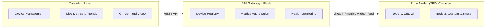

# EdgeVision Nexus

> **⚠️ DOCUMENTATION POLICY**: This is the ONLY markdown file in the project. All documentation must be in this README.md or in code comments. Do not create additional .md files.
>
> **Enforcement**: Run `./check-docs.sh` to verify compliance

An edge-first video intelligence stack: computer vision runs on edge devices, while the dashboard pulls metrics continuously and video on demand. Bandwidth stays low, even as cameras scale.

## Table of Contents

- [Architecture](#architecture)
- [Quick Start](#quick-start)
- [Development](#development)
- [API Reference](#api-reference)
- [Code Documentation](#code-documentation)
- [Testing](#testing)
- [Contributing](#contributing)
- [Troubleshooting](#troubleshooting)
- [License](#license)

## Architecture



## What It Does

- **Edge-First Compute**: Object detection runs on edge devices (minimal bandwidth)
- **Lightweight Metrics**: Metrics streamed continuously; video pulled on-demand
- **Scalable**: Add cameras by deploying more edge nodes
- **Simple Dashboard**: Manage devices, view status, stream video from one place

## Quick Start

### Prerequisites

- Docker & Docker Compose
- No GPU/special hardware required (includes mock mode)

### Run the Stack

```bash
git clone <repo>
cd edgevision-nexus
docker compose up -d
```

**Services:**
- **Dashboard**: http://localhost:3000 (React console)
- **Gateway**: http://localhost:8000 (REST API)
- **Edge Node 1**: http://localhost:5000 (ZED demo, metrics/video)

### First Steps

1. Open dashboard at http://localhost:3000
2. Edge node auto-registers; view metrics and live video
3. Click **Add Edge Node** to register more cameras (IP:port)

## Stopping the Stack

```bash
docker compose down
```

## Adding More Cameras

**Option A: Docker Compose**
- Duplicate `zed_cv_edge` service in `docker-compose.yml` with a new port

**Option B: Physical Device**
- Deploy `cv_edge/` on another Jetson/edge box
- Add via console: **Add Edge Node** → enter device IP:port

## Project Structure

```
edgevision-nexus/
├── README.md                  # This file
├── docker-compose.yml         # Orchestration
├── dashboard-react/           # Console UI (React/TypeScript)
├── api-gateway/               # REST API & device registry (Flask)
├── cv_edge/                   # Edge node service (Flask + CV)
├── ts-sidecar/                # TypeScript sidecar (optional)
└── tests/                     # Integration tests
```

## Development

### Rebuild a Service

```bash
# Rebuild dashboard
docker compose up -d --build dashboard-react

# Rebuild edge node
docker compose up -d --build cv_edge

# Rebuild gateway
docker compose up -d --build api-gateway

# View logs
docker compose logs -f <service>
```

### Running Tests

```bash
python -m pytest tests/ -v
```

## API Reference

### Edge Node Endpoints

**Health Check**
```bash
curl http://localhost:5000/health
# { "status": "ok" }
```

**Get Metrics**
```bash
curl http://localhost:5000/metrics
# { "persons": 5, "vehicles": 2, "fps": 28.5 }
```

**Video Stream (MJPEG)**
```
http://localhost:5000/video_feed
```

### Gateway Endpoints

**Register Device**
```bash
curl -X POST http://localhost:8000/devices \
  -H "Content-Type: application/json" \
  -d '{"url": "http://edge-ip:5000", "name": "Front Door"}'
```

**Get All Devices**
```bash
curl http://localhost:8000/devices
```

## Troubleshooting

| Issue | Solution |
|-------|----------|
| Dashboard won't load | `docker compose ps` → check if all services running |
| No metrics | `curl http://localhost:5000/health` → verify edge node alive |
| Video stream cuts out | Increase network timeout in dashboard settings |
| High memory usage | Reduce refresh rate (3-5 sec intervals) |

## Future Work

- Persistent device storage (currently in-memory)
- Advanced alerting & detection filtering
- Multi-user authentication
- GPU acceleration for inference

## License

MIT

## Code Documentation

All core services are fully documented with inline comments. The code is self-documenting with clear function/class docstrings.

### Key Files Reference

| File | Lines | Purpose |
|------|-------|---------|
| `cv_edge/zed_app.py` | 398 | Edge node: camera capture, object detection, MJPEG streaming |
| `api-gateway/gateway.py` | 499 | Gateway: device registry, metrics aggregation, health monitoring |
| `dashboard-react/src/store/dashboard.ts` | 390 | State management with Zustand, localStorage persistence |
| `dashboard-react/src/hooks/useDevicePolling.ts` | ~50 | Background polling hook (1Hz metrics collection) |
| `dashboard-react/src/App.tsx` | 208 | Main React component with tab navigation |

### Documentation Patterns

**Python Backend:**
- Function docstrings with WHAT/WHY/HOW sections
- JSON request/response examples for all endpoints
- Threading model explanations where applicable
- Performance notes (response times, bottlenecks)

**TypeScript Frontend:**
- Component/hook documentation with purpose and usage
- State management flow explanations
- Browser compatibility notes (URL normalization)
- Memory management (history limits, cleanup)

### Key Concepts

**Device Registration Flow:**
```
User adds device → Modal → Store.addDevice() → URL normalization → 
localStorage save → Polling hook detects → Health check → Status update → 
Dashboard displays
```

**Metrics Collection (1Hz polling):**
```
useDevicePolling hook → For each device: /health + /metrics → 
Store updates → React re-renders → Charts update
```

**Thread Safety (Edge Node):**
- `grab_loop()` runs in background thread
- Uses condition variable (`frame_cond`) for synchronization
- HTTP handlers acquire lock before reading frame data
- MJPEG encoder waits for new frames via `frame_cond.wait()`

**URL Normalization:**
- Problem: Container hostnames (e.g., `http://zed_cv_edge_1:5000`) don't resolve in browser
- Solution: `normalizeDeviceUrl()` replaces with `http://localhost:PORT`
- Applied automatically when adding devices

## Contributing

We welcome contributions! Follow these guidelines:

### Getting Started

1. Fork and clone the repository: `git clone <your-fork> && cd edgevision-nexus`
2. Run locally: `docker compose up -d`
3. Verify: `curl http://localhost:5000/health`

### Development Workflow

1. Create feature branch: `git checkout -b feature/your-feature`
2. Make changes and test: `docker compose up -d --build <service>`
3. Run tests: `docker compose run --rm tests python -m pytest tests/ -v`
4. Commit with clear messages: `git commit -m "feat: description"`
5. Push and create PR

### Code Standards

**Python:**
- PEP 8 style guide
- Type hints where practical
- Docstrings for all functions/classes (WHAT/WHY/HOW format)
- Tests for new features

**TypeScript/React:**
- ESLint configuration (see `dashboard-react/`)
- Functional components preferred
- Meaningful component/variable names
- Props validation

**Commits:**
- Use conventional commits: `feat:`, `fix:`, `docs:`, `test:`, `refactor:`
- Keep commits atomic and focused
- Write descriptive messages

### Documentation Rules

**CRITICAL:** This project maintains a single README.md file for all documentation.

- ✅ **DO**: Add information to this README.md
- ✅ **DO**: Document code with inline comments/docstrings
- ❌ **DON'T**: Create additional .md files (CONTRIBUTING.md, QUICK_START.md, etc.)
- ❌ **DON'T**: Create summary/changelog .md files
- ❌ **DON'T**: Leave internal planning documents

**Verification:**
```bash
./check-docs.sh  # Checks for unauthorized .md files
```

**Protection Mechanisms:**
1. `.gitignore` - Blocks all .md except README.md
2. `.git-hooks/pre-commit` - Git hook prevents committing .md files
3. `check-docs.sh` - Verification script
4. PR template - Checklist enforces policy

If you need to add documentation:
1. Add to appropriate section in this README.md
2. For code-specific docs, use inline comments/docstrings
3. For API changes, update the API Reference section

### Adding New Endpoints

Example: Add `/system_info` to edge node

1. **Read existing patterns** in `cv_edge/zed_app.py`
2. **Write documented function:**
```python
@app.route('/system_info')
def system_info():
    """
    Get system information (memory, CPU, temperature).
    
    RETURNS (JSON):
    {
        "memory_used_mb": 512,
        "cpu_temp_c": 45.2,
        "uptime_seconds": 3600
    }
    
    USAGE:
    - Called by dashboard EdgeNodeMonitor component
    - Displayed in edge node monitoring tab
    
    FREQUENCY: Once per second
    RESPONSE TIME: < 10ms
    """
    # Implementation
```
3. **Update this README** API Reference section
4. **Test**: `curl http://localhost:5000/system_info`

## Support

For questions or issues:
- Open a GitHub issue with detailed description
- Include relevant logs: `docker compose logs <service>`
- Check Troubleshooting section above
